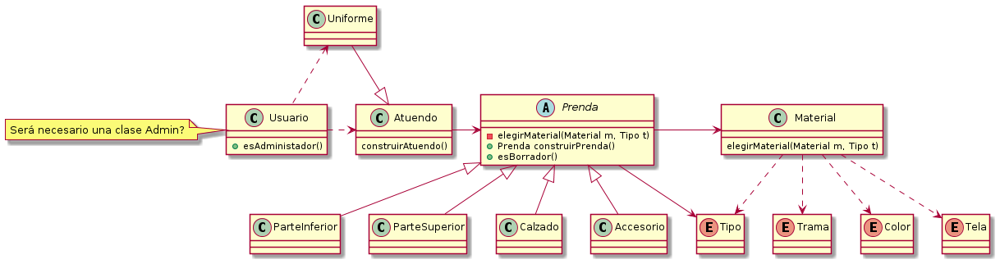

# qmp-iteracion2

# Diagrama de clases




# Pseudocódigo

1. Definimos las prendas como una clase abstracta
```
abstract class Prenda{
        -elegirMaterial(Material m, Tipo t)
        +Prenda construirPrenda()
        +esBorrador()
}
```

2. Definimos los materiales que ahora se agruparán de manera que
podamos elegir uno de ellos junto con el tipo de producto 
```
class Material{
        elegirMaterial(Material m, Tipo t)
}
enum Tipo
enum Tela
enum Color
enum Trama
```

3. Definimos los tipos de atuendos posibles, siendo el uniforme un atuendo 
también

```
class Uniforme inherits Atuendo{
}
class Atuendo{
        construirAtuendo()
}
```

4. Definimos los tipos de usuarios posibles, 
siendo el admin un usuario también por tanto hereda de él
```
class Usuario{
}
class Admin inherits Usuario{}
```

5. 
5. Repetimos los distintos tipos de categorías que anteriormente se habian pedido
en la iteración anterior

```
class ParteSuperior inherits Prenda{
}
class ParteInferior inherits Prenda{
}
class Calzado inherits Prenda{
}
class Accesorio inherits Prenda{
}
```
